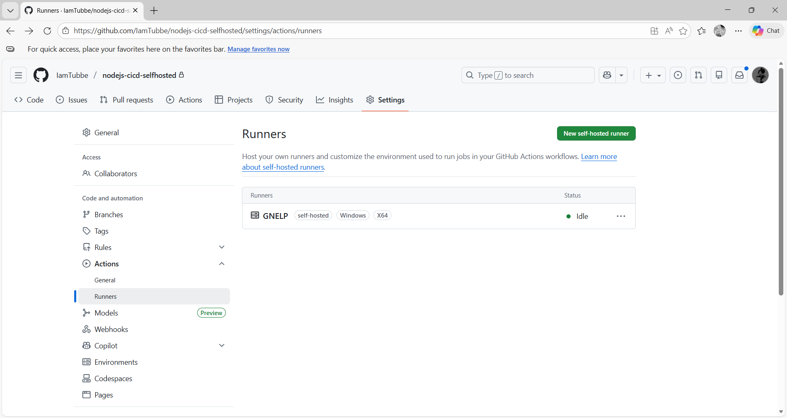
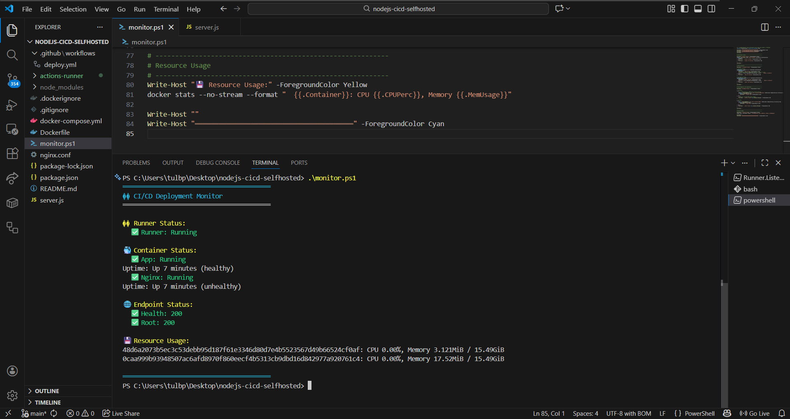

# nodejs-cicd-selfhosted

6.5 ตรวจสอบ Runner บน GitHub
กลับไปที่ Settings → Actions → Runners
ควรเห็น runner แสดงสถานะ Idle สีเขียว
บันทึกรูปผลการทดลอง

บันทึกผลการรันคำสั่ง docker logs nodejs-selfhosted-app

8.2 ใช้ Monitoring Script
บันทึกผลการรัน monitor.sh

คำถามท้ายบท
1. Pull-based Model ของ Self-Hosted Runner คืออะไร มีข้อดีอย่างไร
Pull-based Model ของ Self-Hosted Runner
คือสถาปัตยกรรมการทำงานที่ เครื่อง Runner เป็นฝ่าย “ดึงงาน (pull)” จาก CI/CD Platform เอง เช่น GitHub Actions แทนที่แพลตฟอร์มจะยิงงาน (push) เข้ามาที่เครื่อง Runner โดยตรง
ข้อดีของ Pull-based Model (Self-Hosted Runner)
ปลอดภัยสูง: ไม่ต้องเปิดพอร์ตจากภายนอก ลดความเสี่ยงด้านความมั่นคงปลอดภัย
ทำงานหลัง Firewall ได้: ใช้เฉพาะการเชื่อมต่อขาออก (Outbound)
ควบคุมสภาพแวดล้อมได้เอง: เลือกเครื่องมือ ระบบ และทรัพยากรได้ตามต้องการ
ตั้งค่าและดูแลง่าย: โครงสร้างเครือข่ายไม่ซับซ้อน
เหมาะกับระบบภายในองค์กร (On-Premise): ไม่ต้องพึ่ง Public IP
เหมาะสำหรับระบบ CI/CD ที่ต้องการความปลอดภัยสูงและการควบคุมโครงสร้างพื้นฐานอย่างเต็มที่

2. ทำไม Pull-based ปลอดภัยกว่า Push-based
Pull-based ปลอดภัยกว่า Push-based เพราะไม่มีการเปิดช่องทางให้ระบบภายนอกเข้ามาควบคุม Runner โดยตรง ลดความเสี่ยงจากการโจมตีผ่านเครือข่าย และเพิ่มการควบคุมด้านความมั่นคงปลอดภัยของระบบ

3. ทำไมต้องใช้ npm ci แทน npm install ใน production
npm ci เหมาะกับ production เพราะให้ผลลัพธ์ที่แน่นอน รวดเร็ว และปลอดภัยกว่า ในขณะที่ npm install เหมาะกับการพัฒนา (development) มากกว่า

4. ทำไมห้ามใช้ Self-Hosted Runner กับ Public Repository
ไม่ควรใช้ Self-Hosted Runner กับ Public Repository เพราะเปิดโอกาสให้บุคคลภายนอกสั่งรันโค้ดบนเครื่องภายใน ซึ่งมีความเสี่ยงสูงต่อความปลอดภัยของระบบและข้อมูลสำคัญ

5. nginx คืออะไร และการทำ Revers Proxy ใน nginx มีความสำคัญอย่างไร
Nginx คืออะไร
Nginx เป็นซอฟต์แวร์เว็บเซิร์ฟเวอร์และพร็อกซี (Web Server & Proxy Server) ที่มีประสิทธิภาพสูง นิยมใช้สำหรับให้บริการเว็บไซต์ รับ–ส่งคำขอ HTTP/HTTPS และทำหน้าที่เป็น Reverse Proxy อยู่หน้าระบบ Backend เช่น Node.js, Java, Python เป็นต้น
Nginx เป็นเว็บเซิร์ฟเวอร์ที่สามารถทำหน้าที่เป็น Reverse Proxy เพื่อรับคำขอจากผู้ใช้และส่งต่อไปยัง Backend Server ช่วยเพิ่มความปลอดภัย ประสิทธิภาพ และความเสถียรของระบบ โดยเฉพาะในสถาปัตยกรรมสมัยใหม่
